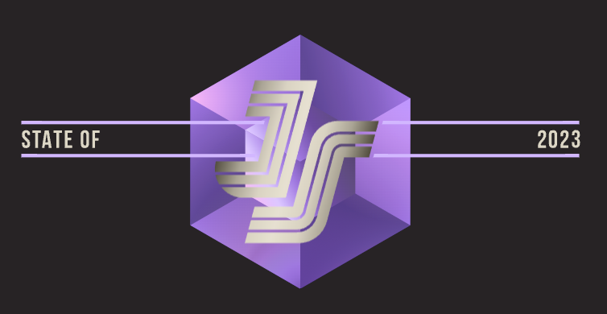
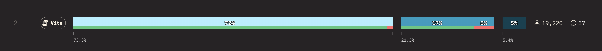
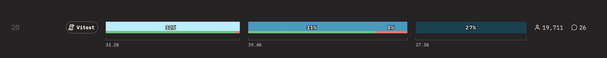
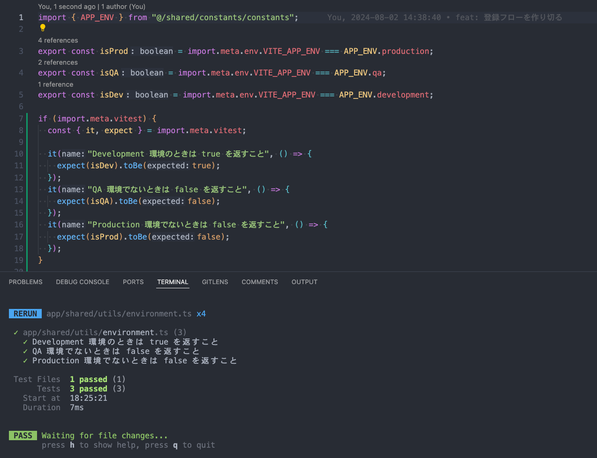
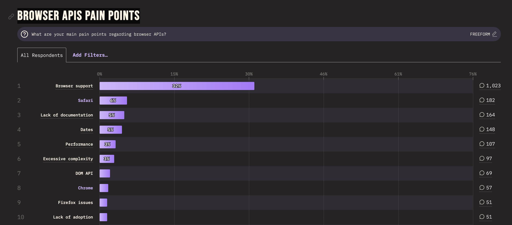
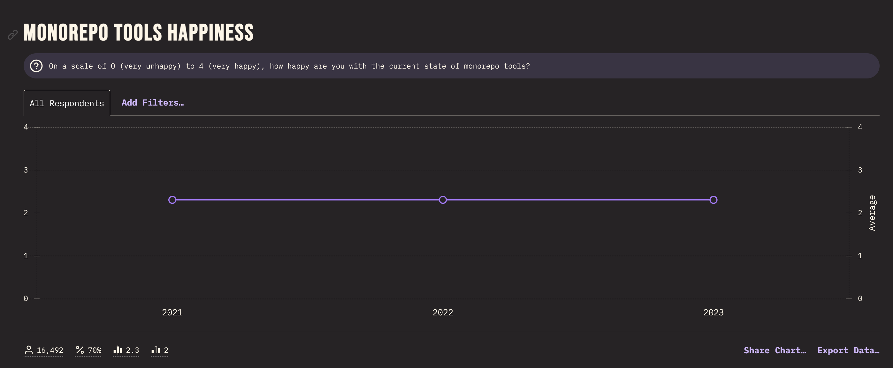
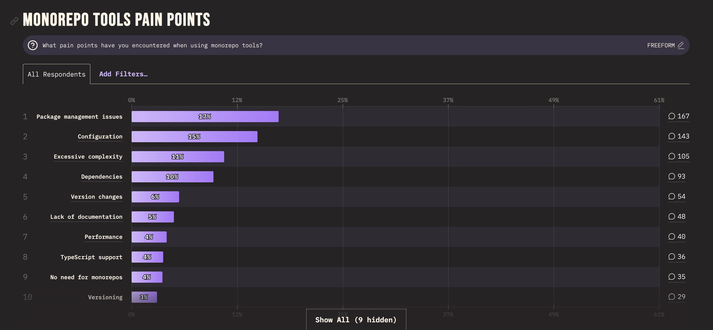
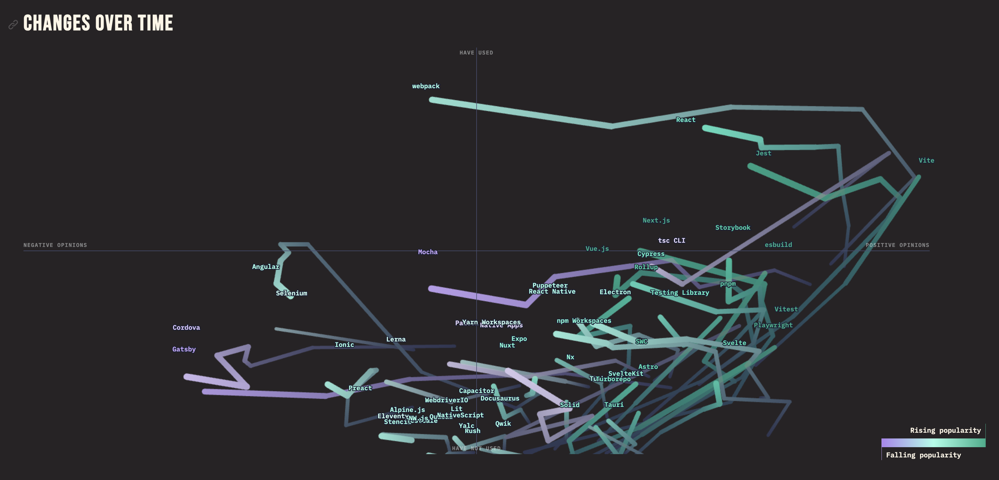
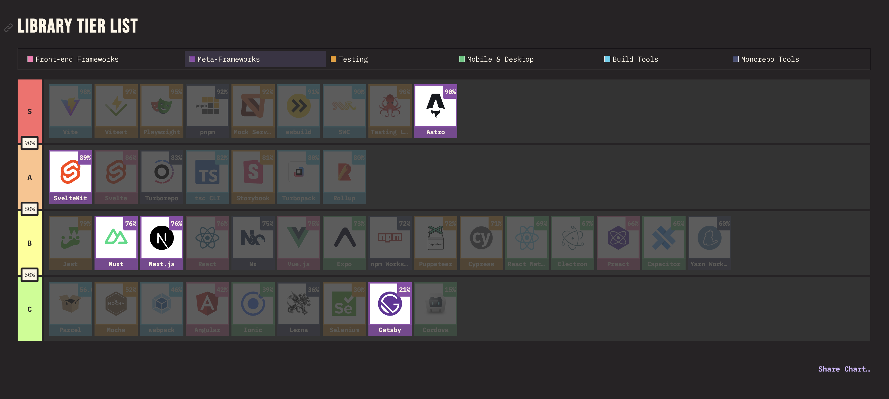
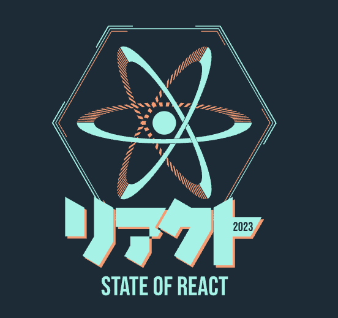

# State of JavaScript 2023 を読む

2024-08-02
人材 PF プロダクト開発室 德永諒介

---

## 目的

- State of JavaScript 2023 を読みながら、2023 年の JavaScript のトレンドを振り返る
- 気になるライブラリをざっくり掘り下げて知見をシェアする

---

## 概要

- State of XXX は毎年 Web 開発エコシステムにおけるトレンドをまとめたレポート
- 各技術に対応して行っている
- 今年は公開がかなり遅くなった

[State of JavaScript 2023](https://2023.stateofjs.com/ja-JP/)

> Speaking of taking it slow, you might be wondering why these 2023 survey results are being released six months into 2024. The truth is, between launching the new State of HTML survey, innovating new question formats, collecting more freeform data than ever, and rewriting a lot of our data visualization codebase, we ended up with a workload that was probably a bit too ambitious, to say the least.

---

## 全体気になったライブラリ・技術まとめ

---

## pnpm

- [pnpm の特徴](https://zenn.dev/azukiazusa/articles/pnpm-feature)

---

## Vite

- 言わずと知れたビルドツール
- Vue よりも流行っている気がする

---

## Vitest

- Vite native のテストランナー
- ポジティブが多い
- 高速・Jest にない機能がある
  - [Vitest Browser Mode がアツい](https://zenn.dev/apple_yagi/articles/b2b96af1fd355c)
  - [Vitest テストコードを実装ファイルと同一のファイルに記述する](https://zenn.dev/azukiazusa/articles/vitest-same-test-file)

---

## Vitest の気になる機能

### In-Source Testing

- [Rust の module tests](https://doc.rust-lang.org/book/ch11-03-test-organization.html#the-tests-module-and-cfgtest) と同じような機能

<https://vitest.dev/guide/features.html#in-source-testing>

---

---

## 面白かったポイントまとめ

---

IE が消えた

---

あまり高まらず

---

モノレポツールは強い意志を持って基盤を整えられる人がいないと厳しい

---

<https://2023.stateofjs.com/en-US/libraries/#tools_arrows>

---

Astro が思ったよりも流行っている

---

## あとがき

<!-- _backgroundColor: #182C36 -->

- State of React 2023 も発表されましたね

